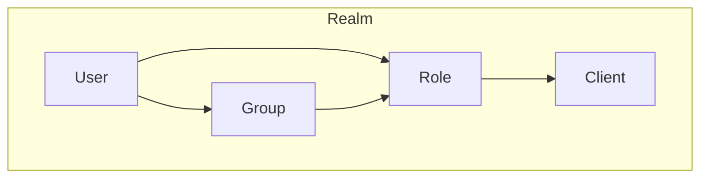
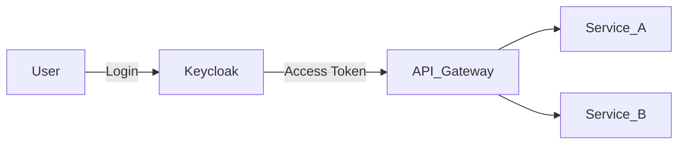
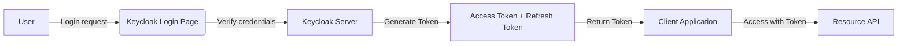

# Keycloak

## Keycloak là gì?

- [Keycloak](https://www.keycloak.org/) là một **Identity and Access Management (IAM)** platform mã nguồn mở do Red Hat phát triển.
- Nó cung cấp sẵn **Authentication & Authorization** mà không cần tự xây từ đầu.
- Hỗ trợ các chuẩn bảo mật hiện đại:
  - **OAuth2**
  - **OpenID Connect (OIDC)**
  - **SAML 2.0**

👉 Hiểu đơn giản: Keycloak chính là **trung tâm quản lý danh tính và quyền hạn** cho toàn bộ hệ thống Microservices.

## Các khái niệm chính

- **Realm**: không gian quản lý độc lập trong Keycloak. Mỗi realm có user, role, client riêng.
- **Client**: ứng dụng (web, backend, microservice) cần sử dụng Keycloak để xác thực.
- **User**: người dùng cuối cùng. Có thể gán vào role hoặc group.
- **Role**: tập quyền được gán cho user hoặc client.
- **Group**: nhóm user, giúp quản lý role theo tập thể.



## Keycloak trong hệ thống Microservices



- Tất cả user đăng nhập qua **Keycloak**.
- Keycloak trả về **JWT Token**.
- Token này được gửi kèm khi gọi API tới Gateway hoặc các microservice.

## Lợi ích khi dùng Keycloak

- Không phải tự viết logic login/logout.
- Hỗ trợ Single Sign-On (SSO).
- Dễ mở rộng: có thể kết nối LDAP, Google, Facebook, GitHub.
- Tích hợp được với nhiều công nghệ (NestJS, Spring Boot, .NET, v.v.).

## So sánh giữa OAuth 2.0, OpenID Connect và SAML 2.0

| Tiêu chí                         | OAuth 2.0                           | OpenID Connect (OIDC)                         | SAML 2.0                                                 |
| -------------------------------- | ----------------------------------- | --------------------------------------------- | -------------------------------------------------------- |
| **Mục đích chính**               | Authorization truy cập tài nguyên   | Xác thực danh tính người dùng dựa trên OAuth2 | Xác thực người dùng giữa các hệ thống (SSO truyền thống) |
| **Định dạng dữ liệu**            | JSON (Access Token, Bearer Token)   | JSON (Access Token, ID Token - JWT)           | XML (SAML Assertions)                                    |
| **Giao thức nền tảng**           | HTTP + REST                         | HTTP + REST                                   | XML + SOAP                                               |
| **Phù hợp cho**                  | API, Mobile App, Service-to-Service | Web app, SPA, Mobile, SSO hiện đại            | Hệ thống enterprise, legacy, intranet                    |
| **Hỗ trợ SSO**                   | Không trực tiếp                     | Có (qua ID Token)                             | Có                                                       |
| **Dễ tích hợp với API hiện đại** | Cao                                 | Rất cao                                       | Thấp                                                     |
| **Độ phổ biến hiện nay**         | Rất cao (chuẩn cơ sở cho tất cả)    | Rất cao (SSO hiện đại)                        | Giảm dần, chỉ còn phổ biến trong enterprise              |
| **Ví dụ triển khai**             | Google OAuth, GitHub API            | Google Sign-In, Microsoft Login               | Azure AD SSO, Okta SAML Integration                      |

## Authentication Flow trong Keycloak

Keycloak hỗ trợ nhiều **authentication flow** tuân theo chuẩn OIDC/OAuth2.0.

| Flow                          | Mô tả                           | Dùng cho             |
| ----------------------------- | ------------------------------- | -------------------- |
| **Authorization Code Flow**   | Web app có backend, bảo mật cao | Web, Server-side App |
| **Authorization Code + PKCE** | SPA, Mobile App                 | React, Flutter       |
| **Implicit Flow**             | SPA cũ, nay deprecated          | Không khuyến khích   |
| **Client Credentials**        | Service-to-Service              | Microservices        |
| **Resource Owner Password**   | CLI hoặc legacy app             | Không khuyến khích   |
| **Device Flow**               | IoT, Smart TV                   | Device không có UI   |

### Tổng quan luồng xác thực Keycloak



## Chọn chuẩn nào cho dự án?

| Tình huống         | Nên dùng chuẩn                          |
| ------------------ | --------------------------------------- |
| Web app có backend | OAuth2 + OIDC (Authorization Code Flow) |
| SPA / Mobile app   | OAuth2 + OIDC + PKCE                    |
| Legacy enterprise  | SAML 2.0                                |
| Service-to-service | OAuth2 Client Credentials               |
| IoT / Device app   | OAuth2 Device Flow                      |

## Setup Keycloak bằng Docker

File `docker-compose.yml`:

```yaml
version: '3'
services:
  keycloak:
    image: quay.io/keycloak/keycloak:25.0.0
    container_name: keycloak-25.0.0
    ports:
      - '8180:8080'
    environment:
      KEYCLOAK_ADMIN: admin
      KEYCLOAK_ADMIN_PASSWORD: admin

    command: start-dev
    restart: unless-stopped
    volumes:
      - ./docker/docker_data/keycloak_data:/opt/keycloak/data
```

## Cách dùng cơ bản

### Tạo Realm

- Vào trang quản trị → `Create Realm`.
- Ví dụ đặt tên: `microservices-realm`.

### Tạo Client

- Trong realm → `Clients` → `Create`.
- Ví dụ client: `order-service`.
- Chọn **Client Protocol = OpenID Connect**.
- Chọn **Access Type = confidential** (nếu service cần secret key).

### Tạo User & Role

1. Vào `Users` → `Add User`.
   - Username: `alice`
   - Đặt password: `123456`

2. Vào `Roles` → `Add Role`.
   - Role: `admin`

3. Gán role cho user `alice`.

### Test đăng nhập

- Truy cập `https://authen.itchms.gov.vn/realms/kttv-monolith/account`.
- Đăng nhập bằng user `alice`.
- Keycloak sẽ trả về **Access Token (JWT)**.

⇒ Access Token này sẽ được sử dụng khi gọi API trong microservices.

## Recap

- Keycloak là **trung tâm quản lý danh tính & phân quyền**.
- Các khái niệm chính: Realm, Client, User, Role, Group.
- Chúng ta đã setup Keycloak cơ bản với Docker, tạo Realm, Client, User, Role.
- Access Token từ Keycloak sẽ là chìa khóa để bảo mật Microservices.
